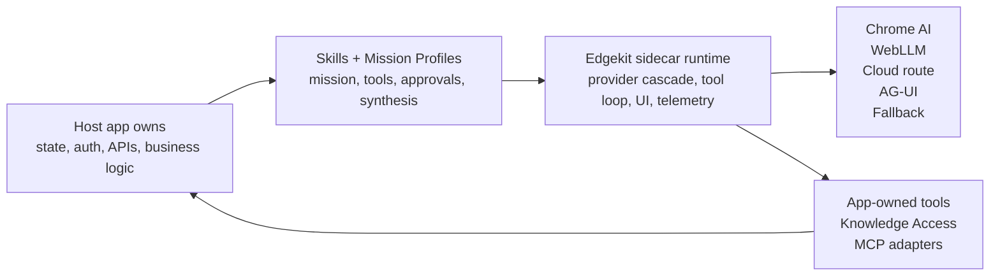
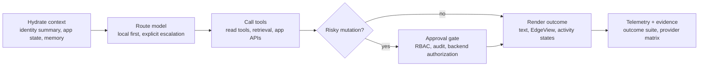

# Edgekit

**Add a local-first AI sidecar to your web app without giving up control of state, tools, or approvals.**

Edgekit is an embeddable browser-native agent runtime for product teams that want agentic help inside an existing web app, not a hosted chatbot bolted beside it. It runs local-first through Chrome AI or WebLLM when available, can escalate only through developer-provided routes, and calls the app capabilities you explicitly register as tools.

The host app keeps ownership of auth, business state, data access, permissions, and mutations. Edgekit provides the sidecar runtime: model routing, tool calling, approval UX, EdgeView rendering, telemetry hooks, audit events, memory adapters, AG-UI support, and validation helpers.

For production work, start with **Skills + Mission Profiles**:

- **Skills** package app capabilities with descriptions, examples, approval policy, synthesis expectations, and UI hints.
- **Mission Profiles** assemble Skills, instructions, defaults, and glue for one localized sidecar experience.
- **Tools** remain app-owned executable functions, registered explicitly by the host app.

## Quick Start

Install the workspace, build packages, and open the demo:

```bash
pnpm install
pnpm build
pnpm dev:ecommerce
```

Open the ecommerce demo at `http://127.0.0.1:5173`.
Open the public docs and demo site at `https://kevinmarmstrong.github.io/edgekit/`.
Open the full documentation at `https://kevinmarmstrong.github.io/edgekit/docs/`.

Build a first sidecar by picking one narrow mission, creating Skills for the app capabilities it needs, assembling a Mission Profile, registering real app-owned tools, and mounting `<edge-chat>`.

Recommended adoption path:

- [30-Minute Production Sidecar](./docs/30-MINUTE-PRODUCTION-SIDECAR.md): fastest path from starter profile to tested sidecar.
- [Getting Started For Real Apps](./docs/GETTING-STARTED-REAL-APPS.md): the full Skills + Mission Profiles walkthrough.
- [Recipe Catalog](./docs/RECIPE-CATALOG.md): scaffold repeatable app patterns such as support workflow, Knowledge Access, and Astro intake plus knowledge.
- [Production Recipes](./docs/PRODUCTION-RECIPES.md): telemetry, audit, RBAC, state hydration, and escalation patterns.
- [Runtime Guarantees](./docs/RUNTIME-GUARANTEES.md): what Edgekit enforces at runtime and what your app must own.

## Architecture At A Glance





## Embed

```ts
import '@kevinmarmstrong/edgekit-ui'
import { modelOptional, tool } from '@kevinmarmstrong/edgekit'
import { z } from 'zod'

const searchProducts = tool({
  description: 'Search the product catalog',
  inputSchema: z.object({
    query: z.string(),
    maxPrice: modelOptional(z.number()),
  }),
  execute: async ({ query, maxPrice }) => {
    const params = new URLSearchParams({ q: query })
    if (maxPrice) params.set('max_price', String(maxPrice))
    return fetch(`/api/products?${params}`).then(res => res.json())
  },
})

const chat = document.querySelector('edge-chat')
chat?.registerTools({ searchProducts })
chat?.registerActions(({ toolName, output }) => {
  if (toolName !== 'searchProducts' || !Array.isArray(output.results)) return []
  return output.results.map(product => ({
    id: `add-${product.id}`,
    label: `Add ${product.name} to cart`,
    toolName: 'addToCart',
    input: { productId: product.id, quantity: 1 },
    fields: [{ name: 'size', label: 'Size', type: 'select', options: product.sizes.map(size => ({ label: size, value: size })) }],
  }))
})
```

For docs search, site-map, catalog, or support assistants that must ground answers in app-owned tools, configure `toolChoice: 'required'`. For agentic workflows, pair that with `toolProvider` so read tools are always available while mutation tools hydrate only when the prompt, session, role, and workflow state justify them. Keep the default `auto` behavior for open-ended assistants.

`registerActions()` produces host-owned CTAs. The UI resolves each submitted form against the active tool surface, validates the tool schema when present, and treats the user's click as confirmation only for trusted host action cards. Arbitrary EdgeView or AG-UI forms cannot directly run tools that are hidden from the current session or marked `needsApproval`.

AG-UI-compatible backends can drive the same component:

```ts
import { createAgUiAgent } from '@kevinmarmstrong/edgekit'

const agent = createAgUiAgent({ endpoint: '/api/ag-ui/support-agent' })
document.querySelector('edge-chat')?.useAgent(agent)
```

Use the native path when the web app can register local tools directly. Use the AG-UI path when an existing backend agent, CopilotKit/LangGraph/CrewAI bridge, or AG-UI HTTP stream should own the run while Edgekit renders the in-app experience.

The public GitHub Pages AG-UI demo uses a scripted mock stream so it can run without a backend. It is meant to prove the renderer and provider boundary; production apps should point `createAgUiAgent()` at a real endpoint or event iterator.

Backend-served generative UI needs a hosted route or worker that can stream AG-UI events, hold provider secrets, enforce rate limits, and call only the app tools you intentionally expose.

```html
<edge-chat
  system-prompt="You are a helpful shopping assistant."
  placeholder="Find running shoes under $100"
></edge-chat>
```

## Scalable Integration Primitives

edgekit stays small by exposing contracts instead of shipping a required cloud service:

- Hybrid routing: `createHybridModelRouter()` keeps simple work local and routes complex work to a developer-provided model.
- Cascade readiness: `createCascadeReadinessController()` checks Chrome AI, WebLLM, fallback, tools, approvals, and UI capability requirements before the app promises a full agent experience. Use it to prompt, suggest, message, hide, or fall back based on the visitor browser and model state. The public [cascade lab](https://kevinmarmstrong.github.io/edgekit/demos/cascade/) includes a real visitor setup flow plus a resettable developer matrix for those states.
- Supervisor routing: `createSupervisorRouter()` gives teams a lightweight supervisor/worker pattern for intent-based delegation without adopting a full multi-agent framework.
- Markdown memory: `createMarkdownMemoryStore()` hydrates relevant `.md` files into the agent context; replace it with IndexedDB, OPFS, vector, or server-backed stores by implementing the same `search()` contract.
- Knowledge Access Skills: `EdgeKnowledgeSource`, `createKnowledgeTool()`, and `createKnowledgeSkill()` wrap app-owned retrieval systems as cited, freshness-aware, read-only Skills. Use Markdown, LlamaIndex, LangChain, Qdrant, Neo4j GraphRAG, SQL, or private APIs behind the same contract.
- Memory compaction: Markdown stores can compact append-heavy logs into current-state snapshots when token thresholds are reached; production apps can provide their own summarizer.
- Cross-agent handoffs: `createHandoffEnvelope()` packages selected memory, app state, public identity, tool names, and trace ids for cloud workers or AG-UI backends.
- Tool repair: `toolRepair` retries validation-shaped tool failures invisibly before surfacing an error to the user.
- Streaming activity states: core emits `activity` events, and `<edge-chat>` renders safe orchestration progress without exposing hidden reasoning.
- Edge response caching: `createMemoryResponseCache()` and `createIndexedDbResponseCache()` let read-only repeat questions bypass inference when state has not changed.
- Parallel-safe tools: `executeParallelTools()` runs app-owned read-only batches concurrently only when manifests opt in with `readOnly` and `parallelSafe`.
- Dynamic tool exposure: `toolProvider({ input, session, phase })` can narrow the model-visible tool set per prompt while `<edge-chat>` still keeps the full registered tool set for user-clicked action forms.
- Offline mutation journal: `createOfflineTool()`, `createMemoryMutationJournal()`, `createLocalStorageMutationJournal()`, and `syncMutationJournal()` queue approved offline-capable mutations and sync them when connectivity returns.
- Guarded tool execution: `createToolPolicyExecutor()` and `executeToolWithPolicy()` enforce timeouts, payload limits, and allowlists around third-party or dynamically loaded tools.
- Redaction middleware: `createPiiRedactor()` and custom redactors sanitize tool results before they reach UI events, telemetry, and audit trails.
- MCP catalogs: `mcpToolsFromDefinitions()` and `loadMcpTools()` adapt safe MCP tool catalogs into normal Edgekit tools.
- Telemetry: pass `telemetry` to `createAgent()`, `createAgUiAgent()`, or `<edge-chat>.configure()` to observe runs, tools, approvals, views, errors, and no-model fallbacks.
- Mission control: `createMissionControl()` provides an in-memory dashboard aggregator; production apps can send the same events to OpenTelemetry, Datadog, PostHog, Supabase, or their own warehouse.
- Audit trails: `createAuditTrail()` records tool calls, approval requests, approval decisions, UI actions, and errors in a hash chain. Bring your own signing or cryptographic hash for strict compliance environments.
- Identity and RBAC: `sessionProvider`, `identityProvider`, `stateProvider`, `toolManifests`, `filterToolManifestsForSession()`, and `withToolContext()` bridge app identity and state into Edgekit without putting auth secrets in the model prompt.
- Coding-agent handoff: `AGENTS.md` documents the architecture, commands, and guardrails for implementation agents.
- Agent adoption kit: `docs/agent-skills/*/SKILL.md` gives coding agents procedural implementation, testing, optimization, and security-review workflows. `edgekit-init` scaffolds repeatable recipes such as `support-workflow`, `knowledge-skill`, and `astro-intake-knowledge`.

```ts
chat.configure({
  memory: createMarkdownMemoryStore({
    documents: [{ id: 'preferences', content: preferencesMarkdown }],
    compaction: { thresholdTokens: 1200 },
  }),
  memoryCompaction: { thresholdTokens: 1200 },
  toolRepair: { maxAttempts: 2 },
  responseCache: createIndexedDbResponseCache(),
  cachePolicy: { ttlMs: 5 * 60 * 1000 },
  redactors: createPiiRedactor(),
  identityProvider: () => ({
    id: currentUser.id,
    tenantId: currentTenant.id,
    roles: currentUser.roles,
    permissions: currentUser.permissions,
  }),
  stateProvider: () => ({
    route: location.pathname,
    view: 'Checkout',
    summary: 'Cart contains 2 items. User is choosing shipping.',
  }),
})
```

## Packages

- `@kevinmarmstrong/edgekit`: core browser-agent runtime, model cascade, tool loop wrapper, provider helpers.
- `@kevinmarmstrong/edgekit-ui`: Lit web component, `<edge-chat>`, EdgeView rendering, and `mountChat()`.
- `@kevinmarmstrong/edgekit-react`: React hook/controller primitives and an idiomatic `<EdgeChat />` wrapper around the web component.
- `@kevinmarmstrong/edgekit-cli`: docs indexing CLI for Q&A/RAG tools.
- `examples/ecommerce`: retrofit demo with product search and add-to-cart tools.
- `site/docs`: full GitHub Pages documentation for concepts, APIs, UI, CLI, testing, and deployment.
- `spike`: Phase 0 validation harness for Vercel AI SDK plus `@browser-ai` providers.

## Roadmap

- Near term: publish the core, UI, React, and CLI packages; add Vue and Svelte wrappers once the React API shape settles.
- Near term: add a browser worker adapter for guarded tools so untrusted client-side compute can run off the main thread with the same policy contract.
- Next: add optional `@edgekit/yjs` and `@edgekit/automerge` adapters on top of the mutation journal for apps that need CRDT-backed collaborative state.
- Later: add a WASM tool adapter for pure compute tools. Keep secret-bearing MCP and data access behind backend/proxy tools, not arbitrary browser-loaded WASM.

## Docs Index CLI

```bash
pnpm --filter @kevinmarmstrong/edgekit-cli build
pnpm --filter @kevinmarmstrong/edgekit-cli index -- README.md DESIGN.md --out edgekit-docs-index.json
```

The generated JSON is portable: register it behind a normal Edgekit tool and let the agent search it like any other app capability.

## Maintainer / Release Evidence

This section is for maintainers and release reviewers. New adopters should start with the Quick Start, 30-minute sidecar guide, and production recipes above.

Core release checks:

- `pnpm test`: unit coverage for model cascade, approval resume, and docs indexing.
- `pnpm typecheck`: strict TypeScript across core, UI, CLI, example, site, and spike.
- `pnpm build`: package and demo production builds.
- `pnpm test:e2e`: browser smoke for ecommerce, scripted workflows, and graceful no-model fallback.
- `pnpm test:workflows`: focused ecommerce workflow coverage.

Release evidence and adoption-quality loops:

- `pnpm eval:models`: real-browser model cascade evals for Chrome AI/WebLLM prompt quality.
- `pnpm eval:adoption`: developer-facing answer quality for integration, authority boundaries, local-first value, and security guidance.
- `pnpm research:agents`: public-surface readiness loop across docs, ecommerce, AG-UI, admin, mission-control, and agent-readable docs.
- `pnpm research:env`: machine/browser preflight evidence.
- `pnpm research:suite`: expansive outcome suite with prompt variants, provider fallback probes, architecture probes, and rubric thresholds.
- `pnpm research:full`: build, environment preflight, suite, and adoption-quality evidence in one pass.

```bash
pnpm test
pnpm typecheck
pnpm build
pnpm test:e2e
pnpm eval:models
pnpm eval:adoption
pnpm research:agents
pnpm research:env
pnpm research:suite
pnpm research:full
```

Provider/reproducibility variants are documented in [docs/REPRODUCIBILITY.md](./docs/REPRODUCIBILITY.md), [docs/DISTRIBUTION-READINESS.md](./docs/DISTRIBUTION-READINESS.md), [docs/CLEAN-ROOM-ADOPTION-PROOF.md](./docs/CLEAN-ROOM-ADOPTION-PROOF.md), and [docs/CLOUDFLARE-ARCHITECTURE-PROOF.md](./docs/CLOUDFLARE-ARCHITECTURE-PROOF.md).

Release-definition and iteration context lives in [WORLD-CLASS-DEFINITION.md](./WORLD-CLASS-DEFINITION.md), [docs/WORLD-CLASS-READINESS-ANALYSIS.md](./docs/WORLD-CLASS-READINESS-ANALYSIS.md), [ARCHITECTURE.md](./ARCHITECTURE.md), and [LOOP-STATUS.md](./LOOP-STATUS.md).

Edgekit Skills are inspectable context artifacts that can be improved without changing runtime model weights. Inspired by [SkillOpt: Executive Strategy for Self-Evolving Agent Skills](https://arxiv.org/pdf/2605.23904), Edgekit supports bounded, validation-gated Skill optimization contracts:

- keep router-visible `description` separate from activated `instructions`
- cap optimizer patches instead of allowing full rewrites
- reject ties and accept only strict held-out improvement
- protect slow-state paths such as safety policy and host-app authority boundaries
- report per-skill effect sizes instead of hiding movement in aggregate scores

See [docs/SKILL-OPTIMIZATION.md](./docs/SKILL-OPTIMIZATION.md).

## Notes

The browser model ecosystem moves quickly. Keep provider-specific code behind `chromeAI()` and `webLLM()` wrappers. Do not hand-roll orchestration, model adapters, streaming, or message formatting; use Vercel AI SDK and `@browser-ai`.

GitHub Pages is a good public docs/basic-mode host, but it does not provide the cross-origin isolation headers needed for the best WebLLM path. Use Cloudflare Pages, Vercel, or another host with COOP/COEP headers when you want the downloadable WebLLM fallback to run in production.
